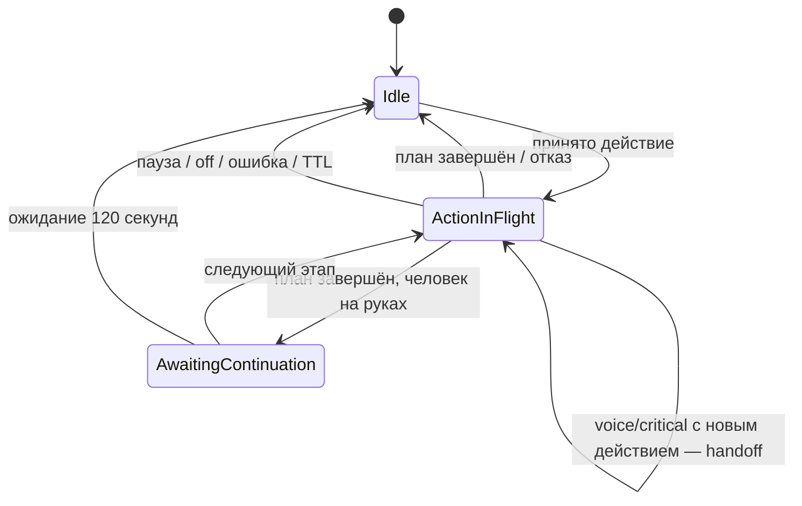

## §160 MCP-агент: присутствие, голос и интерфейс (iteration 160)

Это общий игровой шов внешнего разума. Он не принадлежит Маше: `masha` —
только один авторский пресет тела (§74/§159), а attachment, инбокс игрока,
публичная фаза, мысль и доставка речи работают с любым NPC.

```text
Игрок → FMOD capture → Deepgram → финальный текст
                                      │
                                      ▼
Unity ←───────── /watch ─────── HexLive.Server ─────── /mcp ─────── AgentHost
  └─ FMOD + runtime .vis                 ▲                 └─ LLM/TTS/workspace
                                        └── текст + WAV + статус
```

Редакторский пакет «MCP for Unity» в этот контур не входит. Unity использует
единственный игровой `/watch`, внешний агент — единственный `/mcp`. Дополнительных
`/voice-turn`, `/health`, `/memory`, `/events` и `/audio` нет.

### §160.1 Attachment не является ручным управлением

`attach_agent(npcId, displayName, capabilities, ttlSeconds=45)` создаёт ровно
один attachment на NPC. Он привязан к `Mcp-Session-Id` и generation текущего
мира. Имя ограничено 48 символами; TTL — 15..120 секунд. Повторный attach той
же сессии идемпотентно обновляет запись, конкурентная сессия получает отказ.

Attachment хранит только временный UI/read-model: id, NPC, capabilities,
`Ready|Thinking|Acting|Speaking|Sleeping|Error`, короткий `intentSummary`,
необязательные relation view и свежую запись дневника. Heartbeat приходит
каждые ~10 секунд; после 45 секунд тишины, `detach_agent`, закрытия MCP-сессии,
смерти NPC или world swap запись и незавершённое аудио удаляются.

Attachment НЕ занимает §145 action lease и НЕ включает manual mode. Поэтому
между командами NPC живёт под обычным AI. Перед физическим действием агент
отдельно берёт `acquire_npc_control(..., ttlSeconds=45)`, продлевает примерно
раз в 10 секунд и немедленно освобождает после результата. Исключение —
незавершённая переноска §124: пока человек на руках, между поднятием,
перемещением и укладкой сохраняется тот же lease. Ожидание следующего приказа
при завершённом плане ограничено 120 секундами realtime; off/пауза мира
освобождают управление штатно. Падение процесса
возвращает тело обычному AI не позже 45 секунд.

Пока attachment активен, изменяющие NPC команды игрока отвергаются как
`ControlledByAgent`, чтобы человек и агент не сбивали планы друг друга. Выбор,
карточка и голосовой `AgentTextInput` разрешены. Сам attachment не расширяет
права агента: действия всё равно проходят `WorldHost.SubmitManualCommand` и
единственный валидатор §121/§145.

При attach прежний player lease снимается, тело возвращается AI; чужой
незавершённый MCP action lease не перехватывается (`ActionLeaseBusy`).
Capabilities не дают чужой сессии прав на тело: команды к attached NPC
принимаются только от владельца attachment с `worldActions`.

### §160.2 MCP-инбокс, фазы и commit

В общий каталог MCP добавлены:

- `attach_agent`, `agent_heartbeat`, `read_agent_inbox`, `ack_agent_inbox`;
- `publish_agent_phase`, `commit_agent_turn`;
- `begin_agent_utterance`, `append_agent_utterance`, `commit_agent_utterance`;
- `detach_agent`.

Инбокс хранит до 64 неподтверждённых финальных текстовых сообщений. Элемент содержит
монотонный `seq`, идемпотентный `messageId`, `language`, `text` (до 4096
символов), `createdUtc` и `senderId` из авторизованного подключения, не текста игрока.
Переполнение возвращает InboxFull без удаления старых реплик. Дедупликация
учитывает senderId и последние 4096 ID, включая подтверждённые сообщения.
`read_agent_inbox(..., sinceSeq, limit<=16)` сообщает `gap`, `truncated` и watermark.
После durable commit AgentHost вызывает `ack_agent_inbox(attachmentId, throughSeq)`:
только владелец может удалить уже выданный непрерывный префикс. Потерянное
подтверждение повторяется безопасно; разные говорящие обрабатываются по очереди,
без удаления ещё не обработанной соседней группы. При перезапуске сервера или
новом attachment сохранность process-local inbox и квитанций не обещается.
Аудио игрока и interim-текст сервер и MCP никогда не получают.

`publish_agent_phase` меняет публичную фазу, а `commit_agent_turn` публикует
реакцию и `intentSummary` до 240 символов. Необязательный journal — до 400
символов. Повторный `turnId` является успешным no-op. Только generic Social
изменяется в мире типизированной командой: Warm +0.18, Neutral +0.08,
Tense −0.06, Hostile −0.12 с clamp 0..1 и bounded дедупликацией в save.
`voiceTurn=true` передаётся только для завершённого голосового хода: даже
`reaction=None` запоминается в сохранённом кольце и не может стать ненулевой
реакцией при повторе. По умолчанию voiceTurn=false; автономные None не
вытесняют голосовые IDs. Старые ненулевые реакции совместимы. Гарантия
ограничена последними 64 голосовыми IDs, в том числе после save/reconnect.

Familiarity/Trust/Affinity и настоящий дневник остаются в workspace агента;
сервер лишь временно ретранслирует переданный relation view до detach.
Он включает публичную причину последней оценки и фактические дельты после
clamp (§159.10); полный JSON ограничен 1024 символами, при необходимости
сокращается только публичное пояснение. Полная причина остаётся в локальной
памяти. UI показывает эти данные только в карточке соответствующего голоса.

### §160.3 Исходящая речь агента

TTS и его ключ принадлежат агенту. В MCP загружается точный субтитр и готовый
RIFF WAV: PCM16, mono, 44.1 kHz, не длиннее 60 секунд и не больше 6 MiB.
Субтитр до 600 символов; ошибка TTS сохраняет текстовый ответ (§163.3a).
Один chunk — не больше 192 KiB; индексы строго последовательны, итоговый
SHA-256 обязателен. Незавершённая загрузка удаляется через 30 секунд.
`utteranceId` идемпотентен.

Delivery `player_reply` имеет Talk priority, звучит listener-relative/2D и
слышен независимо от расстояния. Delivery `world` имеет Ambient priority и
остаётся позиционным. Alarm может прервать оба. При ошибке/отсутствии WAV
субтитр всё равно доставляется.

Ответ игроку удерживает рот до конца WAV: штатные Action, Talk и Ambient
не прерывают его, даже когда персонаж начинает работу во время ответа.
Молчаливая тревожная картинка не сокращает оставшееся время речи.
Она также не повышает приоритет звучащего ответа до Alarm: настоящий
тревожный возглас по-прежнему может его прервать (#358).
Длительности и интервалы речи измеряются unscaled-временем, как звук FMOD,
и не ускоряются вместе с игровым временем (#368, повтор #358).

Unity валидирует метаданные и checksum, хранит не более 20 временных WAV/.vis,
строит `.vis` локальным `VoiceVisemeBaker` по правилам §67.7 и воспроизводит
только через FMOD Core/NpcSpeechDirector. Русский и Hexkufa получают text-aware
alignment, неизвестный язык или неудача — acoustic fallback. Для прямого
ответа snapshot `AgentReplyFocus` приглушает природу примерно на 8 dB и
обязательно снимается при окончании, Alarm, ошибке, disable и смене сцены.

Калибровка MFCC/G2P механически экспортируется из авторского профиля через
`Tools/export_runtime_lipsync.py`. Runtime-порт FIR/FFT/MFCC/Viterbi проверяется
побайтно на golden-таймлайнах канонического Python-бейкера; fixtures используют
синтетический сигнал, не голос игрока. Прямой ответ ждёт занятый рот в bounded
очереди; генерация `.vis` выполняется вне главного потока Unity.

### §160.4 Wire v13

Handshake v13 добавляет `AgentIntegrationEnabled` и `SttAvailable`. Новые kinds
append-only: 14 `AgentState`, 15 `SttTokenRequest`, 16 `SttTokenResult`,
17 `AgentTextInput`, 18 `AgentTextResult`, 19 `AgentSpeechBegin`,
20 `AgentSpeechChunk`, 21 `AgentSpeechEnd`.
Версия v15 согласовала лимиты речи 600 символов/60 секунд/6 МиБ;
v16 добавила отдельный лимит relation view 1024 символа (#361);
текущая v17 расширяет финальный ввод до 4096 и несёт expectedAttachmentId (#357),
проверяемый вместе с enqueue под серверной блокировкой;
сервер и клиент обновляются совместно, предыдущие версии отвергаются handshake.

`AgentState` отправляется после handshake и при смене revision. Он содержит
attachment/capabilities/phase/мысль/публичные отношения и `playerPresent`.
Последний истинен, только если авторизованный `/watch` viewer, которому назначен
этот NPC, сейчас подключён. Речь передаётся Begin → Chunk* → End; клиент
отвергает неверный размер, UTF-8, порядок, WAV или checksum до воспроизведения.

### §160.5 STT игрока

Захват выполняется FMOD Core: повторное нажатие или 3 с тишины после речи завершает
запись, предел 30 секунд, минимум 250 мс; слишком тихий сигнал отбрасывается.
На время записи FMOD Core master channel group получает временный mute:
тишина охватывает Studio и raw Core (голос, музыку, окружение), а не только
старый snapshot `VoiceCaptureDuck`. Исходный mute восстанавливается на каждом
пути окончания/ошибки/смены выбора/сцены/`OnDisable`; пользовательские ползунки
§67.15 не изменяются. Центральная UI Toolkit-панель показывает микрофон и
живой RMS-индикатор; галочка завершает запись, отмена отбрасывает её.
`PlayerVoiceCaptureOverlay` и стиль `AgentCapture.uss` общие для разговора с
персонажем и админских команд (§161). FMOD-захват допускает одного владельца
устройства/mute: второй вход не начинает запись, пока первый её не закончил.

После записи авторизованный клиент запрашивает `SttTokenRequest`. Сервер с
секретом `HEXLIVE_DEEPGRAM_API_KEY` получает у Deepgram JWT на 60 секунд и
выдаёт его не чаще четырёх раз в минуту на control owner. JWT, ключ, WAV и
транскрипт не логируются. При отсутствии ключа handshake честно несёт
`SttAvailable=false`, остальной сервер продолжает работать.

Unity через `IPlayerSpeechTranscriber` напрямую вызывает Deepgram Nova-3
prerecorded с `language=ru`, `smart_format=true`, `punctuate=true` и Bearer JWT.
В `/watch` уходит только финальный непустой текст. Микрофон не зависит от
камеры, расстояния, pause или скорости: он доступен выбранному живому NPC с
attachment capability `playerText`, рабочим `/watch`, STT и микрофоном, если
есть место в локальной очереди записей. Thinking/Acting/Speaking агента,
воспроизведение и распознавание прошлой записи не блокируют новый захват.
До 16 записей ожидают последовательного STT только в оперативной памяти;
каждая привязана к исходным NPC и attachmentId, не к текущему выбору. JWT
переиспользуется до 10 секунд перед expiry, а не запрашивается на каждую
запись. При ошибке/отказе показывается недоставка; при переполнении кнопка
временно блокируется с явной причиной. Disable отменяет STT и очищает аудио.
Текст ждёт следующего хода в MCP inbox. Блокировки: loading/replay,
отсутствующий агент, STT, микрофон или заполненная локальная очередь.
Речь длиннее 4096 символов явно отклоняется, без обрезки. После STT локальный
outbox сохраняет текст до server accepted, повторяет тот же messageId при
таймауте/InboxFull и не очищается из-за фазы агента. Смена attachment даёт
явный отказ; уже записанную реплику нельзя отправить новому агенту. Отсутствие
AgentState в коротком окне после reconnect Handshake означает ожидание, а не
отключение: текст и WAV сохраняются до кадра с явным состоянием attachment.
UI сообщает, что реплика сохранена и ожидает подключения. Общая
локальная вместимость записей, текущего STT и ожидающих текстов — 16.

macOS Player обязательно содержит `NSMicrophoneUsageDescription`: запись FMOD
не обнаруживается Unity-сканером managed Microphone API. Штатный
`Tools/build_release.py` перед подписью экспортирует EN/RU термина
`agent.voice.microphone_usage` из общего I2 authoring TSV
`_ArtSource/Voice/native_permissions.tsv` в Info.plist и локализованные
InfoPlist.strings. Этот же TSV импортируется через `Tools/i2_add_terms.py` в
I2Languages.asset; игрового runtime-диалога или второго способа записи нет.

### §160.6 AgentHost, память и экономия

`HexLive.AgentHost` — локальный .NET 8 MCP-клиент без собственного HTTP-сервера.
Профиль содержит MCP endpoint/token, NPC selector, workspace, LLM и TTS.
Конфигурация Маши ищет единственный `profileId=masha`, а не жёсткий NPC901.
Её `SOUL.md`, `USER.md`, `MEMORY.md`, `memory/worlds`, `memory/daily`, imports
и `.state` сохраняются между серверами и играми. XAI/ElevenLabs живут только в
локальном env 0600; OpenAI/STT и bridge bearer отсутствуют.

По §163 агент запускается и останавливается пользователем, независимо от viewer.
На паузе мира агент публикует `Sleeping` (в Studio — «Мир на паузе»),
делает бесплатные MCP-проверки и не вызывает LLM/TTS. Model heartbeat —
по умолчанию раз в 30 секунд realtime; текст игрока и критическое событие запускают
внеочередной ход и сбрасывают таймер. Одновременно идёт один LLM request,
события склеиваются, текст игрока имеет приоритет. Молчание разрешено, но
`intentSummary` обновляется.

Удержание принятого действия (#374/#375): пока выполняется физический приказ,
обычный model heartbeat не вызывает модель и не заменяет маршрут хозяйственной
целью. Текст игрока и существующая категория critical по-прежнему обрабатываются:
разговор с `action=null` сохраняет приказ. Канонические rules требуют `action=null`
для обычного диалога во время действия; замена из voice допустима только при новом
явном принятом приказе игрока, из critical — при существенной угрозе/препятствии.
Новое действие заменяет прежнее с передачей того же lease. При окончании приказа обычный heartbeat
снова разрешён. Если человек уже поднят и текущий этап переноски завершён,
heartbeat может выбрать следующий этап; это явное ожидание продолжения,
ограниченное прежними 120 секундами. Пауза/off/ошибка снимают lease;
падение процесса ограничено серверным TTL 45 секунд. Нового бессрочного
владения или запрета телесных аварий нет.

Перед захватом управления и передачей текущего lease AgentHost проверяет action
по полной `inputSchema` из `tools/list`: required, типы, enum, вложенные свойства,
additionalProperties и дубликаты ключей. Сервер явно объявляет `additionalProperties=false`; enum самодействий, помощи,
инвентаря, рецептов и взаимодействий берутся из текущих типов и каталогов игры. `npcId` всегда связывается с attachment,
модель не выбирает исполнителя. Невалидная замена сохраняет прежнее действие.
Результат содержит только разрешённое имя tool, хеш корреляции turnId и безопасный
машинный код; исходные аргументы, RPC message/data и неизвестные reason не попадают
в feedback/лог. Тот же результат передаётся следующему решению модели. `Completed`
синхронного MCP-действия завершает lease сразу; отказ не считается успехом.
После выполнения плана различаются PlanCompleted, PlanFailed и PlanInvalid;
отсутствие/неизвестность статуса не объявляется успешным завершением.
`ManualOrderFinished` публикуется для контроллера даже при выключенной диагностике:
исход фиксируется до очистки `Plan.Status` в None. Перед новым приказом AgentHost
запоминает epoch/водяной знак событий; получает только последующий исход своего NPC,
проверяет epoch и переводит фиксированный payload в безопасный код. Историческое
завершение другого приказа/персонажа не считается результатом нового действия.
Невалидный JSON решения не фиксирует inbox: повтор получает ту же входящую реплику.



Защита от повтора (#356): прочитанный voice batch подтверждается только после
сохранения решения в transactional outbox, а не после чтения inbox. Ошибка до
этой границы оставляет сообщения для повторной попытки через 30 секунд;
после границы сбой доставки не запускает модель заново. Идентификатор voice
хода вычисляется из attachment и seq/messageId, без текста. Это гарантия в
пределах живого attachment, не постоянный архив входящих сообщений.
При unconscious=true агент не вызывает LLM/TTS и оставляет голос в inbox
до пробуждения; физический AI продолжает работать. Старое intentSummary не
включается в текущий контекст тела и не восстанавливается в UI при reconnect.
Ошибка очищает старую мысль и публикует Error. Одинаковая предыдущей автономная
реплика не озвучивается повторно; новые voice-ответы не фильтруются по тексту.
Astra получает полную ту же схему ответа, что и XAI, включая emotion enum.
Безопасный журнал содержит turn id, trigger, стадию и тип ошибки, но не
транскрипт, модельный ответ или секреты.

`masha on|off|status|doctor|logs` остаётся оболочкой: on запускает AgentHost и
attachment; off сначала detach/release и затем прекращает платные вызовы;
status показывает attachment/presence/phase без секретов; doctor бесплатно
проверяет конфиг, MCP и наличие провайдеров без генерации речи/решения.

`on` и `doctor` используют готовую сборку и не компилируют рядом с работающим
Unity Editor. Обновление локального бинарника — отдельный `masha build` при
закрытом редакторе; production rollout подготавливает эту сборку заранее.
Перед launchd-запуском `on` устанавливает готовые бинарники и запускатель в
`~/.local/state/hexlive/agent-masha`: фоновый процесс не зависит от разрешения
macOS читать внешний диск с репозиторием. Workspace и env не копируются.

Пауза мира отменяет активный модельный ход и запрещает запуск следующего TTS.
Уход игрока лишь обновляет наблюдение времени; он не выключает агента (§163).
Отдельный bond каждого собеседника сохраняет игровые тики последнего завершённого
голосового хода, наблюдаемых ухода/возвращения и ожидание первой реплики после возврата.
Это наблюдения AgentHost, не точное время закрытия приложения; пропущенный при
выключенном агенте выход не выдумывается. world_status передаёт dayLengthTicks;
контекст содержит игровые минуты с последнего общения и наблюдаемого отсутствия,
никогда не реальную дату возвращения. Пауза добавляет ноль, смена мира или откат
делают длительность неизвестной (§163.3a). Только завершённый voice-ход
(включая reaction=None) снимает ожидание; heartbeat и дубли turnId не меняют
время общения и не вызывают повторное приветствие. Если voice-ход начат до последнего
наблюдаемого возвращения, его позднее завершение не снимает ожидание новой
реплики после этого возвращения (#364). Численные отношения не
повышаются автоматически за вход в игру. Обязательный блок отношений предшествует
обрезаемым Markdown-выдержкам. Редактируемые SOUL/USER не перегенерируются поверх
существующих файлов. Известный старый шаблон «голос дорог» мигрируется после backup;
живые воспоминания не переписываются. Язвительность не означает
постоянную враждебность. Ответ — обычно 2–3 содержательных предложения в прежнем
лимите 600 символов (§163.3a); история recentConversation не считается новой просьбой.
Физическая команда имеет независимый renewal-loop до окончания приказа и не
задерживает голосовой ответ. Переполнение transactional outbox — явная ошибка,
а не удаление неподтверждённых ходов; Social старого эпизода не применяется
к новому миру при reconnect.

Экспериментальный LLM backend `HEXLIVE_AGENT_LLM=codex` использует официальный
`codex exec` с существующим входом ChatGPT, моделью `gpt-5.6-terra` и усилием
`low` для сокращения задержки диалога. API-ключ OpenAI не используется; расходуется лимит подписки Codex.
CLI запускается ephemeral, без пользовательского конфига, shell/MCP-инструментов
и наследования игровых секретов. Контекст передаётся через stdin, результат
валидируется тем же валидатором, что и Grok; игровые действия выполняет только
AgentHost. Временный результат удаляется, stdout/stderr не логируются.
Таймаут 120 секунд и отмена завершают дерево CLI; fallback на Grok отсутствует.
ElevenLabs остаётся отдельным платным TTS. Sleeping не вызывает и этот backend.
`masha terra` выбирает этот режим и перезапускает только локального агента
(`masha astra` оставлен как legacy alias выбора subscription backend);
`masha on/off` продолжает работать с выбранным режимом.

### §160.6a Наблюдения между модельными ходами (#389)

Живой attachment включает runtime-буфер на его NPC. `PerceptionSystem` после
штатного medium-сенсора копирует только реально видимые объекты, людей и зверей:
воспоминания `FromMemory`, невидимые и только слышимые люди не добавляются.
Это не новый сенсор и не изменение радиуса или частоты восприятия. Между
сенсорными обновлениями новых наблюдений не выдумывается.

На каждый id хранится последнее увиденное состояние, первый/последний тик,
координаты цели и наблюдателя. Дополнительный `significantEvent` сохраняет самую
тяжёлую замеченную травму за интервал, даже если NPC затем поправилась:
поздний текущий вид не стирает событие и имеет приоритет при оценке её состояния.
Пуловые mutable-записи сенсора не удерживаются;
состояние ушедшего человека и исчезнувшего предмета не перечитывается из мира.
`describe_colonist.recentPerception` возвращает не переданные завершённому ходу
наблюдения, уже отсутствующие в последнем живом восприятии, а также значимые
события травм независимо от текущей видимости. Текущий вид остаётся
в обычных полях и имеет приоритет. Поля `*WhenSeen`, `lastSeenTile`, `lastSeenTick`
и `ageTicks` обозначают прошлое; это повод вернуться проверить, не право
взаимодействовать со скрытой целью.

Запрос передаёт `perceptionEpoch` и `perceptionSince`; ответ — `epoch`,
`watermark`, `reset`, `gap` и `observations`. AgentHost двигает курсор только
после записи решения в durable outbox. Ошибка модели, отмена, бессознательность
и пропущенный из-за физического действия heartbeat не потребляют наблюдения.
Улики, пришедшие во время модельного запроса, остаются после его watermark.
Если новая менее тяжёлая травма объединяется с уже сохранённой тяжёлой,
курсор такого события обновляется, а исходные время и координаты сохраняются:
подтверждение старого ответа не удаляет обновлённый слот.
Это память живого attachment: повторное соединение с тем же attachment её
сохраняет, новый attachment/откат меняет epoch; после рестарта агент может
получить повторные улики. Наблюдения не записываются в save или wire-снапшот.

Память ограничена 128 объектами, 48 людьми, 16 зверями и 16 значимыми травмами
на attachment, с одним слотом на id в категории. Обычные категории вытесняют
самую старую запись; отдельные события травм — старейшую наименьшей срочности,
с приоритетом умирающих/бессознательных. Старые раненые не блокируют новые
обычные встречи; категории не вытесняют друг друга. Присланный курсор
завершённого хода освобождает потреблённые слоты, сохраняя более поздние
наблюдения. `gap=true` сообщает о потере после потреблённого курсора, в том
числе если более тяжёлые травмы вытеснили новое менее тяжёлое событие.
Долгий приказ не запускает дополнительный модельный
ход; bounded-буфер переживает задержку и честно отмечает переполнение.

У обычных NPC буфер отсутствует. Горячий сбор переиспользует массивы и
словари фиксированной вместимости, без JSON, строкового форматирования или
полного обхода мира; аллокации ответа происходят только при чтении MCP.
Detach, TTL, смерть и смена мира освобождают массивы сразу, даже на паузе.
Регрессии и профилирование запускаются в Unity Editor; отдельно проверяется
реальный MCP и граница durable-потребления в AgentHost.

### §160.7 Пресеты и миграция Маши

Реестр authored character presets владеет только внешностью/spawn. `masha`:
Jana mesh, Marta skin/body materials, authored Jana eyes/hair, утверждённая
одежда и VoiceBank masha. Старый `MashaCompanionHasSpawned` мигрирует в
generic-набор созданных preset id, `NPCState.Companion` читается как legacy
импорт и больше не обновляется. `--character-preset masha` — основной флаг;
`--companion masha` — deprecated alias одного релиза.

Существующий production save и физический NPC901 сохраняются. При выдаче
первого персонажа текущему player id authored `profileId=masha` имеет приоритет,
но runtime UI и протокол не проверяют этот id.

### §160.8 UI и готовность

Generic UI Toolkit-контроллер показывает микрофон под дневником любого
выбранного NPC с attachment. При attach один раз показывается локализованный
toast с displayName. Фазы: «Готов», «Слушаю», «Распознаю», «Думает»,
«Говорит», «Агент отключён», «STT недоступно», «Нет микрофона». Во время
Thinking плашка показывает «Агент думает…», после commit — intentSummary,
после detach — обычную мысль симуляции. Manual toggle и изменяющие действия
disabled с причиной `ControlledByAgent`.

Готовность требует round-trip wire v13, эксклюзивность/TTL/cleanup attachment,
блокировку player commands, обычный AI вне action lease, отсутствие платных
вызовов без игрока, дедупликацию message/turn/utterance, безопасный Deepgram
JWT, только текст во входящем MCP, строгий WAV/chunk/checksum, runtime lip sync,
2D/3D маршрутизацию и восстановление обоих FMOD snapshot. Secret scan не должен
находить ключи, JWT, WAV или транскрипты в репозитории и логах.

В мире лобби (§162) профиль явно присутствует в ростере с зарезервированным id;
его одежда и внешность берутся из подтверждённой карточки. Сохраняются стартовые
потребности, бутылка, повязка и маркер однократного появления. Копия карточки
становится обычным персонажем без profileId.

Админские исключения и отдельная голосовая шина описаны в §161; обычные
игровые права и требования этого раздела сохраняются.
